# ☀️ Solar Charge Controller with Basic MPPT (Ongoing)

## 📌 Overview
This project focuses on the design and development of a **solar charge controller with basic Maximum Power Point Tracking (MPPT)** for efficient energy harvesting and battery charging. The system is built around a **modular power electronics architecture** with embedded control capability for future expansion.

The design emphasizes efficient DC-DC conversion, real-time sensing, and robust hardware implementation for renewable energy applications.

---

## ⚡ Power Architecture (Hardware Design)

### 🔋 60V → 12V Buck Converter
- High-voltage solar input step-down stage  
- Designed for stable and efficient conversion  
- Focus on low losses and thermal stability  
- Supports variable solar input conditions  

<table>
	<tr>
		<td align="center"><strong>Schematic</strong></td>
		<td align="center"><strong>PCB Layout</strong></td>
	</tr>
	<tr>
		<td align="center">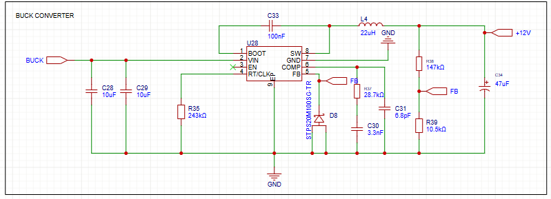</td>
		<td align="center">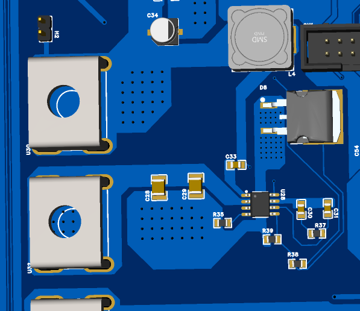</td>
	</tr>
</table>

---

### 🔋 12V → 5V Buck Converter (5A Capability)
- Dedicated power rail for control electronics and peripherals  
- Designed for high current (up to 5A) operation  
- Stable output for ESP32 and sensor modules  
- Optimized PCB routing for power integrity  

<table>
	<tr>
		<td align="center"><strong>Schematic</strong></td>
		<td align="center"><strong>PCB Layout</strong></td>
	</tr>
	<tr>
		<td align="center">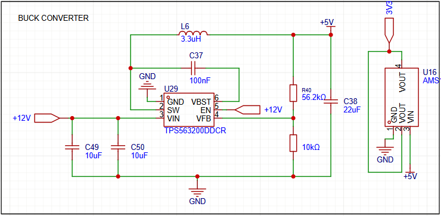</td>
		<td align="center">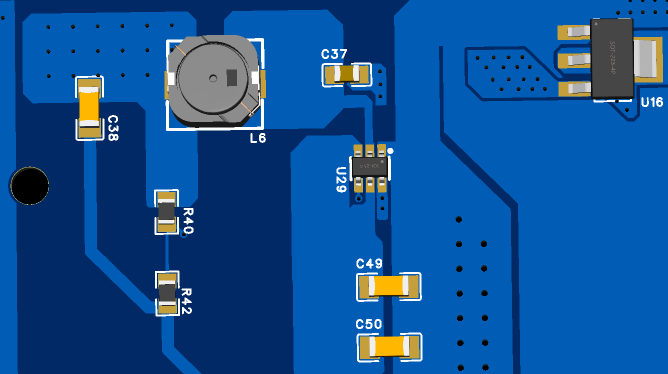</td>
	</tr>
</table>

---

## 🧠 Control Hardware (ESP32 Integration)
- ESP32-based control platform for system management  
- PWM output interface for power stage control (hardware interface only)  
- GPIO expansion for sensing and control signals  
- Modular design for future firmware integration  

<table>
	<tr>
		<td align="center"><strong>ESP32 Schematic</strong></td>
		<td align="center"><strong>ESP32 PCB Layout</strong></td>
	</tr>
	<tr>
		<td align="center">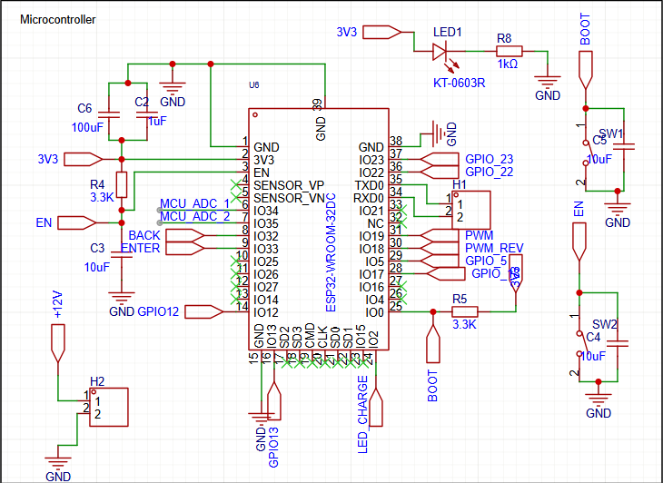</td>
		<td align="center">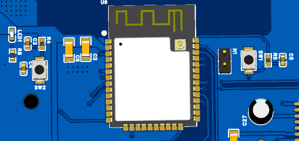</td>
	</tr>
</table>

---

## 📊 Sensing Hardware Design

### ⚡ Voltage Sensing Circuit
- Scaled voltage divider network for ADC interfacing  
- Designed for high-voltage monitoring (solar + battery side)  
- Focus on accuracy and noise reduction  

<table>
	<tr>
		<td align="center"><strong>Voltage Sensing Schematic</strong></td>
		<td align="center"><strong>Voltage Sensing PCB</strong></td>
	</tr>
	<tr>
		<td align="center"></td>
		<td align="center">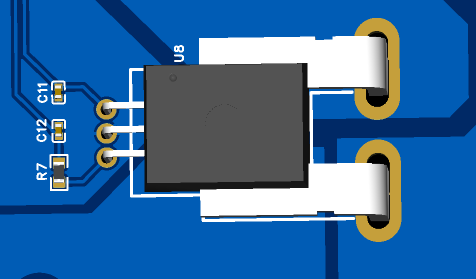</td>
	</tr>
</table>

---
## 📊 Metal Enclosure Design

<table>
	<tr>
		<td align="center">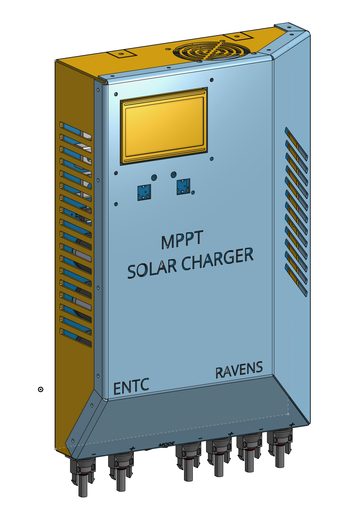</td>
		<td align="center">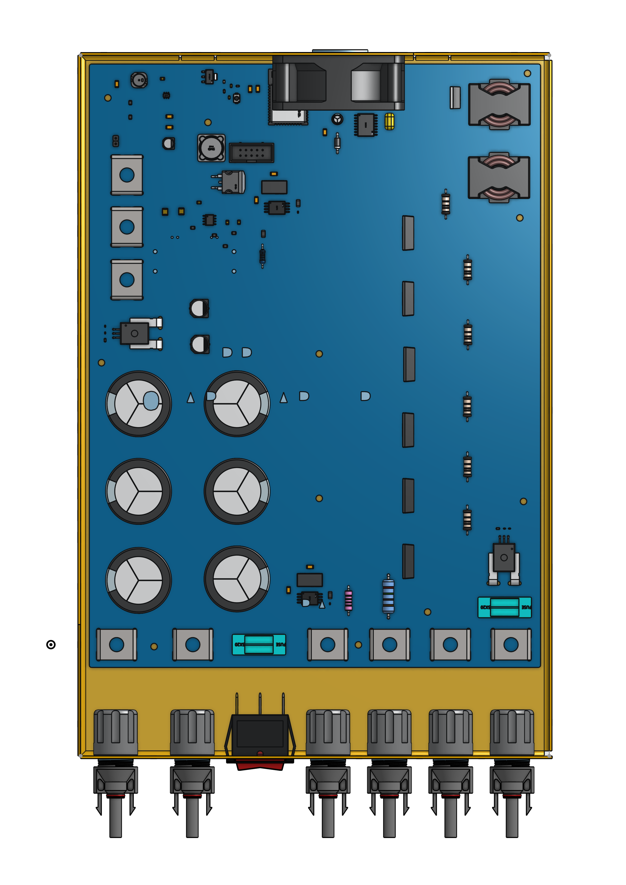</td>
		<td align="center"></td>
		<td align="center"></td>
	</tr>
</table>

---

## 🧩 System Highlights
- Modular dual buck converter architecture  
- Independent power stages for improved reliability  
- Clean separation of power and control sections  
- Designed for scalability and real-world deployment  
- Optimized PCB layout for power electronics  

---

## 🛠️ Hardware Design Workflow
- System architecture planning  
- Power stage design (buck converters)  
- Component selection and validation  
- Schematic design  
- PCB layout and routing  
- Design rule checks (DRC)  
- Gerber generation for fabrication  
- Hardware testing and validation  

---

## 👨‍💻 My Contributions
- 🔧 Designed **60V → 12V high-efficiency buck converter stage**  
- 🔧 Designed **12V → 5V buck converter (5A output capability)**  
- 🔧 Selected key power and control components  
- 🔧 Designed complete PCB layout and routing  
- 🔧 Developed voltage and current sensing hardware circuits  
- 🔧 Integrated ESP32-based control hardware interface  
- 🔧 Ensured manufacturability and design optimization  

---

## 📸 Project Gallery

	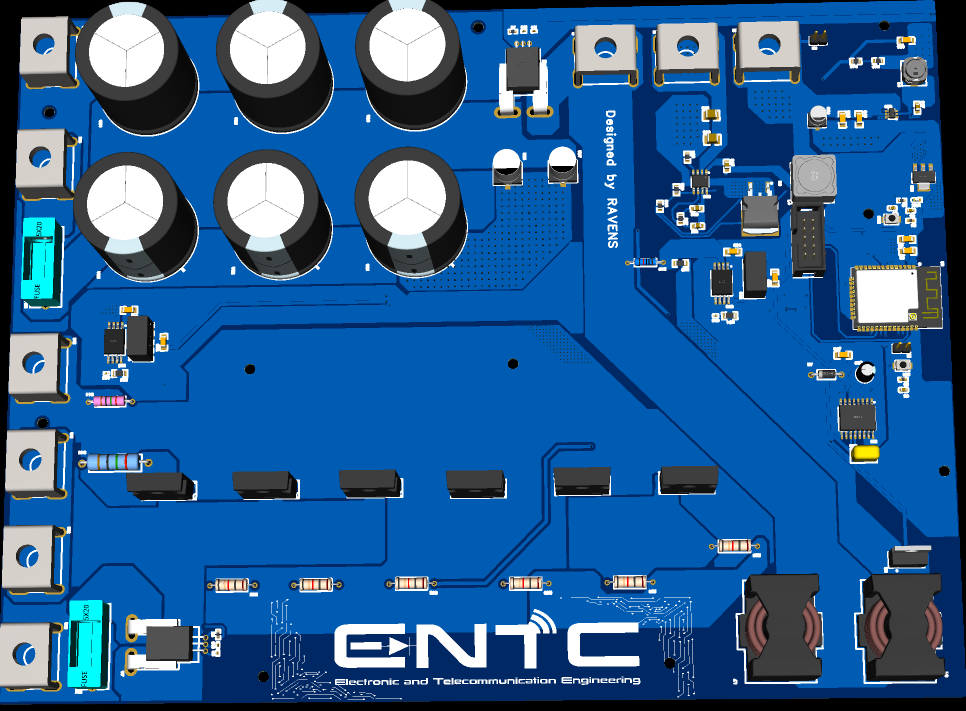
	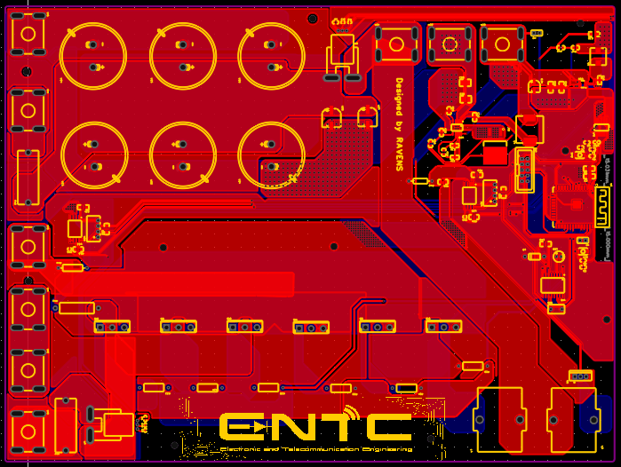
	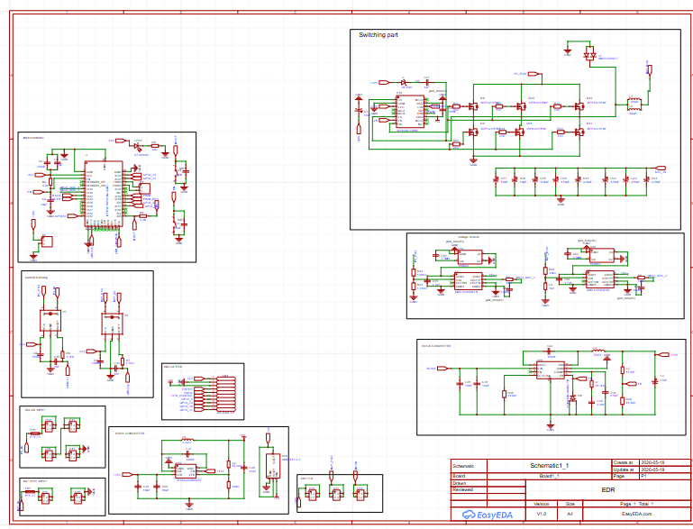

---

## 📸 Product
<table align="center">
  <tr>
    <td>
      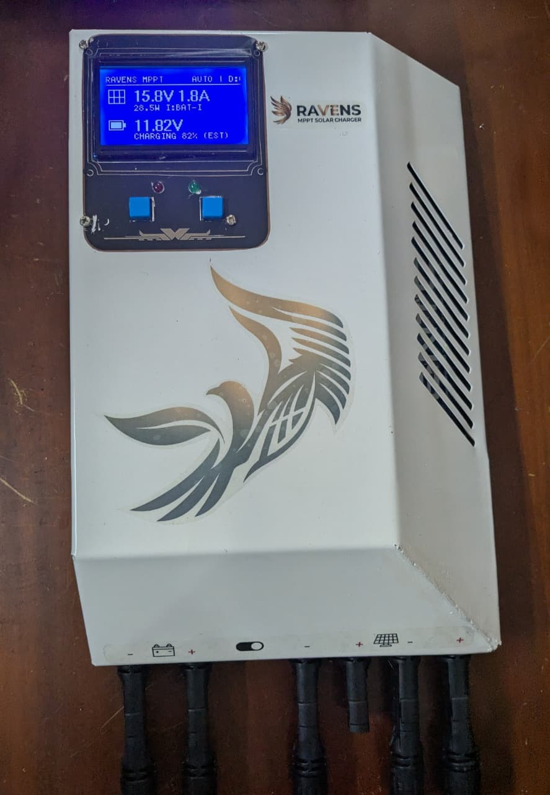
    </td>
    <td>
      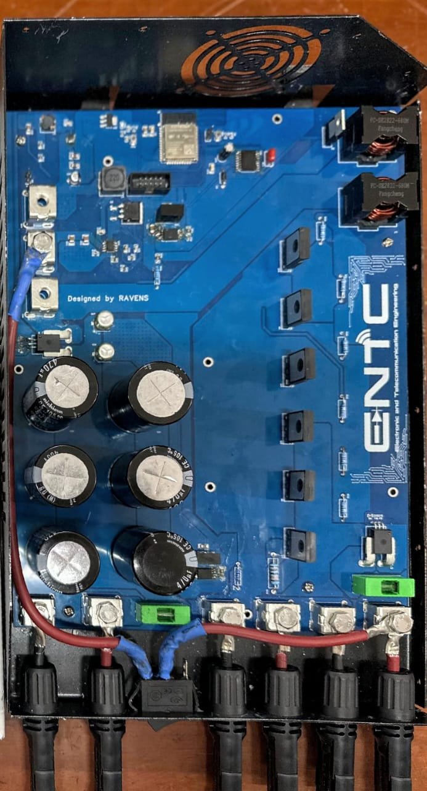
    </td>
  </tr>
  <tr>
    <td>
      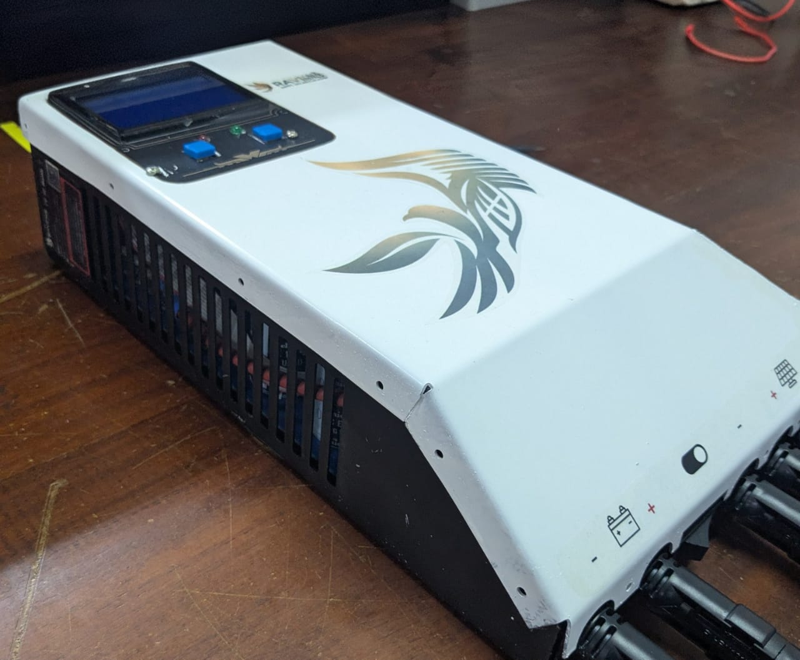
    </td>
    <td>
      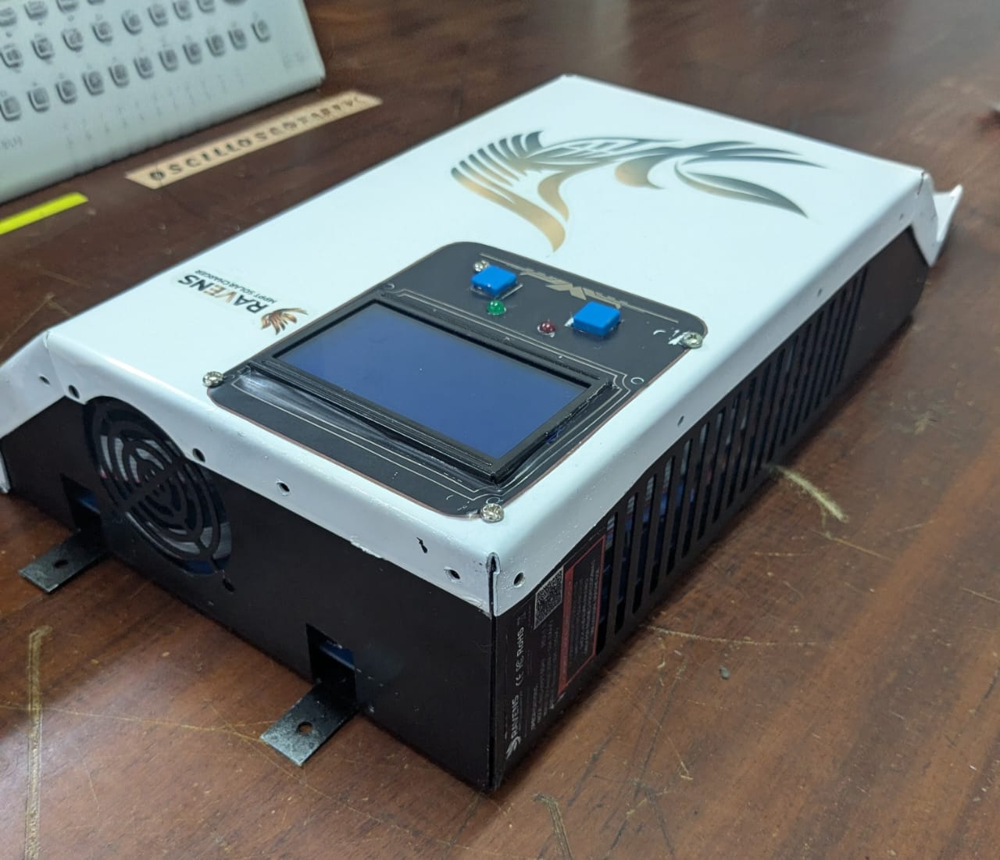
    </td>
  </tr>
</table>

---

  <video width="600" controls>
    <source src="https://github.com/user-attachments/assets/xxxxxxxx" type="video/mp4">
  </video>

## 🚀 Applications
- Solar Energy Charging Systems  
- Off-grid Power Systems  
- Battery Management Systems (BMS) Prototyping  
- Embedded Power Electronics Platforms  
- Renewable Energy Research Projects  

---

## 🧠 Skills Demonstrated
- Power Electronics Design  
- DC-DC Converter Design (Buck Topology)  
- PCB Design for High Power Systems  
- Analog Sensing Circuit Design  
- Embedded Hardware Integration (ESP32 Interface)  
- Design for Manufacturability (DFM)  

---

## 📌 Future Improvements
- Synchronous buck converter design for higher efficiency  
- Improved thermal management system  
- Integrated protection circuits (OVP, OCP, reverse polarity)  
- Advanced MPPT hardware optimization  
- Enclosure design for field deployment  

---

## 🤝 Acknowledgements
This project is part of ongoing work in **embedded systems and power electronics**, focusing on renewable energy hardware design and practical solar energy optimization systems.
